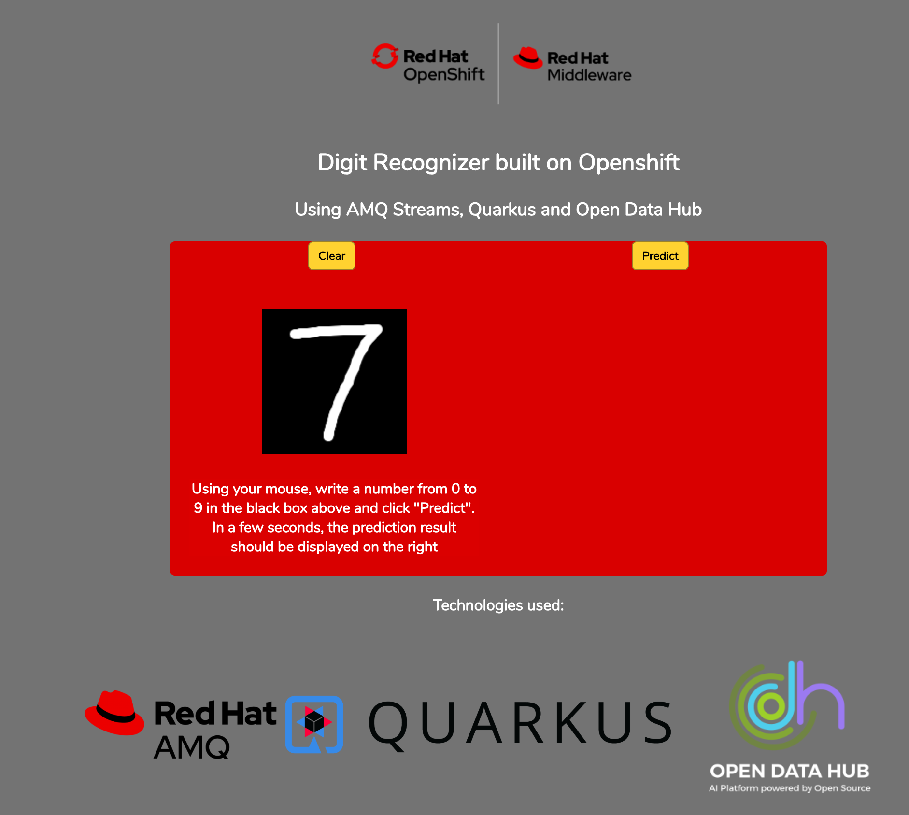

# Handwriting Recognition on Openshift using Quarkus, AMQ Streams and Open Data Hub 
In this module, you will learn how to install and configure the AMQ Streams and Open Data Hub Operators on Openshift 4.x.

This workshop consists of a Quarkus web application, that provides the input (a handrwitten digit), a simple Python application that takes the input, performs a prediction and returns that prediction to the web application. Kafka topics will be used to pass the input data to the python application, and another topic to return the inference (prediction) to the web application.  

## Prerequisites
* Red Hat Openshift 4.2+ environment 
* Basic knowledge of Openshift Operators
* Openshift 4 CLI `oc` for your local environment from [https://mirror.openshift.com/pub/openshift-v4/clients/ocp/latest/]().

## Getting Started
Log into your Openshift console with `cluster-admin` privileges. 
Under `Home`, select `Projects`. Click `Create Project`.

> Name: ***mnist-demo***
> 
> Display Name: ***MNIST Demo***
> 
> Description: ***Quarkus web application, using Kafka, to predict handwritten digits***

***IMPORTANT:***  *Project name MUST be `mnist-demo` for the application to work correctly.*

Next, go to `Operators` > `OperatorHub`

#### Install AMQ Streams operator

Find the AMQ Streams operator and clike `Install`.
On the `Create Operator Subscription` page, under `Installation Mode`, select ' A specific namespace on the cluster'. Ensure that `mnist-demo` is selected. Leave all other settings and click `Subscribe`
You should see the AMQ Streams operator. Click on `AMQ Streams`.

On the **Overview** page of the operator, find `Kafka` under the **Proved APIs** and click `Create instance`. Leave all settings as is and click `Create`.
>This will take a couple of minutes to spin up the necessary Kafka and Zookeeper pods

From the menu directly below **AMQ Streams**, select `Kafka Topic`. Click `Create KafkaTopic`. In the YAML file shown, under the `metadata` section change `name` from `my-topic` to `incoming`. It should look like this: 

apiVersion: kafka.strimzi.io/v1beta1 
kind: KafkaTopic 
metadata: 
&nbsp;&nbsp;	  name: ***incoming*** 
&nbsp;&nbsp;	  labels: 
&nbsp;&nbsp;&nbsp;&nbsp;    strimzi.io/cluster: my-cluster 
&nbsp;&nbsp;  namespace: mnist-demo 
spec: 
&nbsp;&nbsp;  partitions: 10 
&nbsp;&nbsp;  replicas: 3 
&nbsp;&nbsp;  config: 
&nbsp;&nbsp;&nbsp;&nbsp;    retention.ms: 604800000 
&nbsp;&nbsp;&nbsp;&nbsp;    segment.bytes: 1073741824 

Click `Create` to create the Kafka topic.

Repeat these steps to create another KafkaTopic called `prediction`.   

apiVersion: kafka.strimzi.io/v1beta1 
kind: KafkaTopic 
metadata: 
&nbsp;&nbsp;	  name: ***prediction*** 
&nbsp;&nbsp;	  labels: 
&nbsp;&nbsp;&nbsp;&nbsp;    strimzi.io/cluster: my-cluster 
&nbsp;&nbsp;  namespace: mnist-demo 
spec: 
&nbsp;&nbsp;  partitions: 10 
&nbsp;&nbsp;  replicas: 3 
&nbsp;&nbsp;  config: 
&nbsp;&nbsp;&nbsp;&nbsp;    retention.ms: 604800000 
&nbsp;&nbsp;&nbsp;&nbsp;    segment.bytes: 1073741824 

Once created, you should see two KafkaTopics (KT) listed: `incoming` and `prediction`.

#### Install Open Data Hub operator
Go back to `Operators` > `OperatorHub`. Type **Open Data Hub** in the `Filter by keyword...`  search bar. Select the ***Open Data Hub Operator*** and click `Install`. Ensure that the `mnist-demo` project is selected as the specific namespace. Click `Subscribe`.

On the `Installed Operators` page, click on the **Open Data Hub Operator**.  
Click on `Create Instance` under **Provided APIs**, then click `Create`.  
>This will take a couple of minutes to spin up the necessary pods. 

#### Installing the Quarkus web app
On your local machine, open up a terminal session and login to the Openshift environment, using `oc` and your cluster admin credentials. It should look similar to the command below, substituting your Openshift URL and cluser administrator login user.

`oc login https://api.cluster-mnist-xxxx.mnist-xxxx.example.opentlc.com:6443 -u cluster-admin`

Once you have logged in, ensure you are using the newly created **mnist-demo** project.
`oc project mnist-demo`
Create a new app, using the specified **Github** repository for the web application. 
`oc new-app registry.access.redhat.com/redhat-openjdk-18/openjdk18-openshift~https://github.com/gmccarth/mnist-openshift --name=mnist-demo-app`
This will create the web app called **mnist-demo-app**, under the **mnist-demo** project. 
>This will take several minutes to run, as it needs to download the necessary libraries for the app.

In the Openshift web console, go to `Workloads` > `Pods` to see the list of pods. If you see a pod called something similar to `mnist-demo-app-1-xyz12`, then the web app has deployed successfully. 

We need to expose the service in order to make it accessible on the web. To do this, type `oc expose svc/mnist-demo-app` from the terminal on your local machine.

Now, go to the Openshift web console to `Networking` -> `Routes`. You should see a new route for **mnist-demo-app**. Before we go to this URL for the web app, we need to configure our Python environment, so it can run the Prediction app.

## Putting it all together
#### Configuring the Python environment

In the `Networking` > `Routes` section of the Openshift web console, get the location for `jupyterhub` and navigate to that URL in another tab of the web browser.
>You may be asked to sign in with Openshift. If so, use the same cluster-admin user id and password that you used for Openshift.

If you get an **Authorize Access** page, ensure that `user:info` is checked and click `Allow selected permissions`.
You will be taken to the **Jupyter Spawner Options** page. Leave all the defaults and click `Spawn`
>This will take a couple of minutes to set up the jupyter notebook for you. When it is ready you'll see the notebook showing the `lost+found` directory.  

In the `jupyter notebook`, click on `New` and `Terminal` as highlighted in the image below:

In the Notebook terminal run the following commands:  
`pip install keras`  
`pip install tensorflow`  
`pip install kafka`  
Ignore any warnings at this time. Next we need to pull down the Python application that we use to predict the numbers. Run the following in the terminal.  
`wget https://raw.github.com/gmccarth/mnist-openshift/master/src/main/resources/assets/infer.py`  
To check that it downloaded correctly, type `ls -l` in the terminal, and you should see `infer.py` listed, along with the `lost+found` directory. 
#### Run the Python app
In the terminal, type `python infer.py` and hit reurn. The app should initialize and you should see `Ready` on the terminal.
#### Use the web application
In the Openshift web console, go to `Networking` > `Routes` and copy the location of the mnist-demo-app URL. Open that URL in a new browser tab. Using your mouse, draw a single digit between 0 and 9 in the black square as shown below:

Click on Predict and wait a few seconds for the result. To see the prediction directly on the Python application, go back to your `jupyter notebook` and the prediction is written to the terminal each time a new number is submitted.